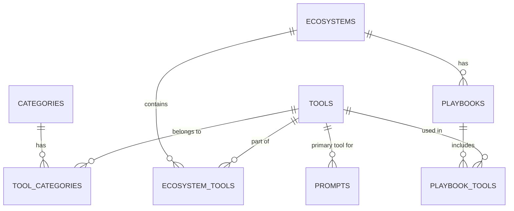

# Entities and Relations

This document outlines the core entities (database tables) and their relationships within the MyCaptionAI Tools Platform. It is intended to help developers understand the data schema quickly.

## Core Entities

### 1. `tools`
The central entity representing an AI tool or product.
- **Primary Key:** `id` (UUID)
- **Key Fields:** `slug`, `name`, `description`, `pricing_type`, `rating_score`, `upvotes`
- **Relations:** 
  - Belongs to many `categories` (via `tool_categories`).
  - Belongs to many `ecosystems` (via `ecosystem_tools`).
  - Belongs to many `playbooks` (via `playbook_tools`).
  - Has many `prompts` (via `prompts.primary_tool_id`).

### 2. `categories`
Categories used to group tools (e.g., "Video Generators", "Text Generators").
- **Primary Key:** `id` (UUID)
- **Key Fields:** `name`, `slug`, `parent_id` (for nested sub-categories), `tool_count`
- **Relations:**
  - Has many `tools` (via `tool_categories`).
  - Can have a self-referencing relationship (Parent/Child categories) via `parent_id`.

### 3. `prompts`
A library of AI prompts (e.g., ChatGPT prompts, Midjourney prompts) that users can copy and use.
- **Primary Key:** `id` (UUID)
- **Key Fields:** `slug`, `title`, `prompt_body`, `prompt_type` (e.g., 'chat', 'image', 'video'), `copy_count`, `tool_tags`
- **Relations:**
  - Belongs to a single primary `tool` (via `primary_tool_id`).

### 4. `ecosystems`
Broad ecosystems that contain multiple interconnected tools (e.g., "OpenAI Ecosystem", "Google Workspace AI").
- **Primary Key:** `id` (UUID)
- **Key Fields:** `name`, `slug`, `description`, `icon_url`
- **Relations:**
  - Has many `tools` (via `ecosystem_tools`).
  - Has many `playbooks` (via `playbooks.ecosystem_id`).

### 5. `playbooks`
Curated tech stacks or workflows combining multiple tools to achieve a specific goal.
- **Primary Key:** `id` (UUID)
- **Key Fields:** `title`, `slug`, `description`, `ecosystem_id`
- **Relations:**
  - Belongs to a single `ecosystem` (via `ecosystem_id`).
  - Has many `tools` (via `playbook_tools`).

---

## Junction Tables (Many-to-Many Relationships)

### 1. `tool_categories`
Links `tools` to `categories`.
- **Foreign Keys:** `tool_id`, `category_id`

### 2. `ecosystem_tools`
Links `tools` to `ecosystems` with additional context.
- **Foreign Keys:** `tool_id`, `ecosystem_id`
- **Context Fields:** `role_category`, `integration_type`, `when_to_use`, `best_for` (explains *why* the tool belongs in this ecosystem).

### 3. `playbook_tools`
Links `tools` to `playbooks` to represent a step-by-step workflow.
- **Foreign Keys:** `tool_id`, `playbook_id`
- **Context Fields:** `step_order` (the order of the tool in the playbook), `step_description`.

---

## Entity-Relationship Diagram Summary

## Additional Tables

- **`search_logs`**: Logs user search queries and the number of results returned to improve the search engine and track popular keywords.
- **`featured_tools` & `trending_tools`**: Specialized tables mapping specific tools for curated showcase positions on the homepage (`display_order`).
