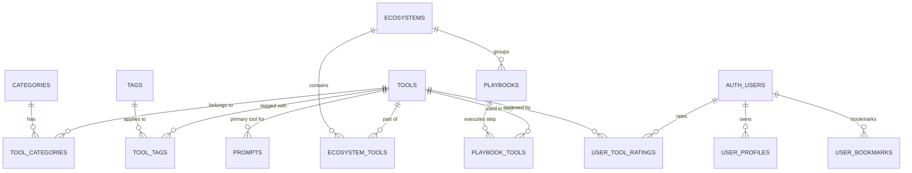

# MyCaptionAI Tools Library — Project Brief

This document serves as the comprehensive project brief and technical documentation for the **MyCaptionAI Tools Library** platform. It details the project's purpose, services, architecture, database schema, and design language to align developers and stakeholders.

---

## 1. Project Overview

### 1.1 Project Title
**MyCaptionAI Tools Library** (Internal name: `mycaptionai_library`)

### 1.2 Project Description
MyCaptionAI is a high-performance, content-rich, and search-optimized discovery platform built for creators, marketers, developers, and AI enthusiasts. It enables users to browse, search, and filter a curated index of artificial intelligence tools, step-by-step workflow guides (playbooks), structured AI prompts (e.g., ChatGPT, Midjourney, Claude), and specialized tool ecosystems.

The application follows a **Server-First**, **Static-First**, and **Index-Driven** architecture to achieve sub-second page loads, maximum search engine visibility (SEO), and a premium user experience.

---

## 2. Core Services Provided

The platform delivers a suite of discovery and productivity services:

1. **AI Tools Directory & Curation**:
   * A central, verified index of AI tools with structured pricing models (`Free`, `Freemium`, `Paid`, `Free-Trial`, `Contact`), ratings, feature lists, use cases, and pros/cons.
   * Community-driven submit portals for tool authors.
2. **AI Prompt Library**:
   * A repository of copyable, structured prompts categorized by prompt type (e.g., `chat`, `image`, `video`, `seo`, `marketing`, etc.) and difficulty (e.g., `beginner`, `intermediate`, `advanced`).
   * A one-click copy function with copy tracking.
3. **Ecosystem Groupings**:
   * Dedicated pages detailing tool integrations inside major AI platforms and developer frameworks (e.g., OpenAI Ecosystem, Google Workspace AI, Supabase Ecosystem).
   * Contextual integration guides, integration types, recommendations, and caveats.
4. **Workflows & Playbooks**:
   * Guided, multi-tool recipes (playbooks) detailing step-by-step procedures to achieve complex digital outcomes (e.g., "Build an Automated Blog using AI").
   * Estimated completion times, prerequisites, difficulty tiers, and step goals.
5. **Geographic AI Directory ("AI by Country")**:
   * An interactive, map-based directory locating where AI companies and tools originate globally, allowing filtered searches based on launch origin.
6. **Advanced Hybrid Search & Semantic Discovery**:
   * Dual-layered search combining high-speed Full-Text Search (`tsvector` index) and vector-based semantic search (`pgvector` cosine similarity embeddings) for intent-based matching.
7. **User Personalization & Engagement**:
   * Secure user authentication with customizable user profiles.
   * User bookmark collections (to save tools, playbooks, prompts) and rating/review capability.
8. **Built-in Analytics & Search Monitoring**:
   * A privacy-conscious, action-focused logging system tracking clicks, search queries, referral sources, and pageviews to optimize directory algorithms.

---

## 3. Project Technical Stack

The architecture is built on modern web technologies optimized for high speed, low maintenance, and scalability.

* **Frontend Framework**: [Next.js](https://nextjs.org) (v16.1.6 App Router)
  * React v19.2.3 & TypeScript v5.
  * Server Components by default to optimize Time to First Byte (TTFB).
  * Dynamic ISR (Incremental Static Regeneration) for listings and SEO landing pages.
* **Database & Backend-as-a-Service**: [Supabase](https://supabase.com) (PostgreSQL)
  * Row Level Security (RLS) policies implemented on all tables to enforce security at the database layer.
  * Custom database triggers for syncing user profile creation with auth triggers.
  * Database-level search indexing utilizing PostgreSQL `gin` indexes and `vector` (1536-dimensional embeddings) with `pgvector` for semantic querying.
* **Database Client & SSR**: `@supabase/ssr` (v0.8) and `@supabase/supabase-js` (v2.95)
* **Styling & Theme**: [Tailwind CSS](https://tailwindcss.com) (v4)
  * Implemented using `@tailwindcss/postcss` for seamless CSS compilation.
  * Design tokens mapped via Vanilla CSS custom properties (`--bg-primary`, `--brand`, etc.) defined globally in `globals.css`.
* **Icons**: `lucide-react` (v1.18) for premium SVG interface icons.
* **Scripts & Admin Tools**: Node.js and `tsx` scripts for database seeding, site configuration backups, and SEO QA checks.

---

## 4. Project Tree Structure

Below is the directory mapping of the `mycaptionai_library` workspace:

```
mycaptionai_library/
├── .github/                   # GitHub workflows & CI/CD deployment pipelines
├── app/                       # Next.js App Router root folder (Routing & Layouts)
│   ├── about/                 # About page
│   ├── actions/               # Next.js Server Actions (mutations & contact/submissions)
│   ├── ai-by-country/         # Geographic AI directory index & dynamic routes
│   ├── ai-tools/              # Main directory list view with filters
│   ├── api/                   # API Endpoints (internal search logging, vector API)
│   ├── auth/                  # Authentication pages (login, callback redirect, signout)
│   ├── best/                  # Curated lists of "best" tools by category
│   ├── blog/                  # Blog post indexes and details (/blog/[slug])
│   ├── categories/            # High-level category overview page
│   ├── category/              # Dynamic category landing pages (/category/[slug])
│   ├── contact/               # Contact form page
│   ├── ecosystems/            # Ecosystem listings and dynamic pages (/ecosystems/[slug])
│   ├── playbooks/             # Workflow playbooks listing and guides (/playbooks/[slug])
│   ├── privacy/               # Privacy Policy
│   ├── prompts/               # Prompt library search and dynamic pages (/prompts/[slug])
│   ├── search/                # Main search results and filter interface
│   ├── sitemaps/              # Dynamic XML sitemaps for tools, categories, prompts
│   ├── submit/                # Tool submission form portal
│   ├── terms/                 # Terms of Service
│   ├── tools/                 # Dynamic tool detail pages (/tools/[slug])
│   ├── top-rated/             # Highest rated tools listing
│   ├── where-ai-comes-from/   # Interactive map directory visualizer page
│   ├── globals.css            # Styling entry point, Design tokens, & custom properties
│   ├── layout.tsx             # Root layout wrapping metadata and providers
│   ├── page.tsx               # Primary landing homepage
│   └── robots.ts              # Dynamic robots.txt generation
├── components/                # Reusable React UI components
│   ├── analytics/             # Built-in visitor logging trackers
│   ├── auth/                  # Login cards and profile widgets
│   ├── layout/                # Global layout wrappers (Header, Footer)
│   ├── ui/                    # Atom/base design components (buttons, badges)
│   ├── ai-country-map.tsx     # SVG/JSON interactive mapping UI
│   ├── tool-card.tsx          # Card component displaying tool overview
│   ├── prompt-card.tsx        # Copyable prompt card widget
│   ├── playbook-card.tsx      # Curated playbook card widget
│   ├── search-bar.tsx         # Unified vector/tsvector search inputs
│   └── ...                    # Contextual layout helper components
├── data/                      # Local JSON datasets & geographic coordinate paths
│   ├── country-boundaries-paths.json
│   ├── global_ai_landscape.json
│   └── tools-snapshot.json
├── docs/                      # Development guides and architectural specs
│   ├── engineering_standards.md
│   ├── entities and relations.md
│   └── ...
├── lib/                       # Business logic, configurations, and helpers
│   ├── db/                    # Supabase database controllers (methods grouped by model)
│   ├── supabase/              # Supabase clients (client, server, admin) & DB schemas (.sql)
│   ├── seo/                   # SEO metadata helpers & breadcrumb engines
│   └── ...
├── public/                    # Public assets (icons, brand logos, static files)
├── scripts/                   # Seeding, syncing, and directory backup scripts
│   ├── backfillToolIcons.ts   # Automated tool favicon backfiller
│   ├── seedEcosystemTools.mjs # Seeds ecosystem junction mappings
│   ├── seedPlaybooks.mjs      # Seeds default playbook workflows
│   ├── syncLandscapeTools.cjs # Syncs landscape datasets with database
│   └── seoQaCheck.mjs         # Custom script checking sitemaps and tags
├── package.json               # Package declarations and script definitions
├── tsconfig.json              # TypeScript engine configurations
└── next.config.ts             # Next.js configurations
```

---

## 5. Database Entities & Relations

The PostgreSQL database is hosted on Supabase. Row-Level Security (RLS) is enabled on all tables, limiting write access to authorized admin tokens (`service_role`) and letting anonymous web visitors read public data (`anon`).

### 5.1 Entities Description

#### 1. `tools`
The master record of all AI tools in the directory.
* **Fields**: `id` (UUID), `name`, `slug` (Unique), `short_description`, `long_description`, `url`, `affiliate_url`, `image_url`, `icon_url`, `pricing_type` (pricing_enum), `starting_price`, `has_free_trial`, `is_verified`, `status` (tool_status_enum), `is_featured`, `is_sponsored`, `sponsored_rank`, `priority_score`, `upvotes`, `view_count`, `click_count`, `rating_score`, `rating_count`, `publisher`, `launch_year`, `country`, `features` (JSONB), `pros_cons` (JSONB), `use_cases` (JSONB), `social_links` (JSONB), `embedding` (VECTOR 1536), `search_vector` (TSVECTOR), `source`, `source_scraped_at`.

#### 2. `categories`
Hierarchical taxonomy groupings for tools.
* **Fields**: `id` (UUID), `name` (Unique), `slug` (Unique), `description`, `parent_id` (Self-referencing Foreign Key), `icon_name`, `seo_title`, `seo_description`, `is_featured`, `display_order`, `tool_count`.

#### 3. `tags`
Granular tagging for cross-cutting categories.
* **Fields**: `id` (UUID), `name` (Unique), `slug` (Unique), `description`.

#### 4. `ecosystems`
Ecosystem communities that cluster multiple tools together.
* **Fields**: `id` (UUID), `name` (Unique), `slug` (Unique), `description`, `icon_url`.

#### 5. `playbooks`
Workflow blueprints outlining guides to achieve tasks.
* **Fields**: `id` (UUID), `title`, `slug` (Unique), `description`, `ecosystem_id` (FK to ecosystems), `author_id` (FK to auth.users), `is_published`, `target_user`, `outcome`, `difficulty` (difficulty_enum), `estimated_time`, `best_for`, `prerequisites` (Text[]), `source_urls` (Text[]), `display_order`, `seo_title`, `seo_description`.

#### 6. `prompts`
Copyable structured AI prompt blueprints.
* **Fields**: `id` (UUID), `slug` (Unique), `title`, `description`, `cover_url`, `youtube_url`, `prompt_type` (prompt_type_enum), `prompt_format` (prompt_format_enum), `prompt_body`, `prompt_data` (JSONB), `tool_tags` (Text[]), `tags` (Text[]), `primary_tool_id` (FK to tools), `tips` (JSONB), `difficulty` (difficulty_enum), `use_case`, `language_code`, `status` (status_enum), `review_status` (review_status_enum), `is_featured`, `visual_position`, `view_count`, `copy_count`, `favorite_count`, `seo_title`, `seo_description`, `canonical_url`, `source_url`, `created_by` (UUID), `published_at`.

#### 7. `blog_posts`
Editorial articles.
* **Fields**: `id` (UUID), `title`, `slug` (Unique), `excerpt`, `content`, `cover_image_url`, `author`, `status` (draft/published/scheduled), `is_featured`, `tags` (Text[]), `seo_title`, `seo_description`, `published_at`.

#### 8. `user_profiles`
Profile information linked directly to Supabase Auth accounts.
* **Fields**: `id` (UUID, FK to auth.users), `display_name`, `avatar_url`, `username` (Unique), `bio`, `website_url`, `twitter_handle`, `role` (user/moderator/admin), `is_active`, `onboarding_completed`.

#### 9. `user_bookmarks`
Links users to their bookmarked content (tools, playbooks, prompts).
* **Fields**: `id` (UUID), `user_id` (FK to auth.users), `entity_type` (tool/playbook/social_post), `entity_id` (UUID).

#### 10. `user_tool_ratings`
Stores reviews and ratings from users.
* **Fields**: `id` (UUID), `user_id` (FK to auth.users), `tool_id` (FK to tools), `rating` (Integer: 1 to 5), `review` (Text).

#### 11. `contact_submissions`
Form data sent via the contact page.
* **Fields**: `id` (UUID), `name`, `email`, `subject_type` (sponsorship/issue/collaboration/general/other), `message`, `user_id` (Optional FK to auth.users), `status` (pending/read/archived).

#### 12. `tool_submissions`
Developer submission entries of AI tools awaiting approval.
* **Fields**: `id` (UUID), `tool_name`, `official_url`, `submitter_email`, `submitted_by`, `relationship_to_company`, `description`, `note`, `company_contact`, `added` (Boolean), `abuse` (Boolean), `reviewed` (Boolean), `admin_notes`.

#### 13. `analytics`
Activity streams tracking clicks, pages, and search logs.
* **Fields**: `id` (UUID), `user_id` (FK to auth.users), `event_type`, `tool_id` (FK to tools), `query`, `path`, `referer`, `device_type`, `country`, `metadata` (JSONB), `occurred_at`, `session_id`, `visitor_id`, `referrer_host`, `user_agent_hash`, `ip_hash`, `country_code`, `region`, `city`, `language`, `page_title`, `action_name`, `action_target`.

#### 14. `site_settings`
KeyValue configs controlling landing metrics dynamically.
* **Fields**: `key` (Text, Primary Key), `value` (JSONB).

---

### 5.2 Entity Relationships

The data layer employs multiple many-to-many join mappings:
* **Tool Categories**: `tool_categories` (`tool_id` ↔ `category_id`) mapping many tools to many categories.
* **Tool Tags**: `tool_tags` (`tool_id` ↔ `tag_id`) mapping many tools to many tags.
* **Ecosystem Tools**: `ecosystem_tools` (`ecosystem_id` ↔ `tool_id`) with metadata mapping many tools into ecosystems.
* **Playbook Steps**: `playbook_tools` (`playbook_id` ↔ `tool_id`) representing order-based tool usage within playbooks.
* **Featured Showcase Mappings**: `featured_tools`, `trending_tools`, and `trending_categories` linking tools/categories to showcase positions.



---

## 6. Color Palette & Visual Style

The interface leverages a modern, immersive aesthetic that emphasizes **micro-contrast, glowing accents, and tactile surfaces** to deliver a premium developer-oriented user experience.

### 6.1 Core Color Palette

| Token name | Hex value | Description |
| :--- | :--- | :--- |
| `--bg-primary` | `#15161c` | The main slate-dark viewport background |
| `--bg-secondary` | `#1c1d24` | Sidebar/footer backgrounds |
| `--bg-surface` | `#24252f` | Directory cards & default interactive panels |
| `--bg-surface-hover` | `#2d2e3c` | Cards hover active color |
| `--brand` | `#6366f1` | Indigo/violet base color for primary elements |
| `--brand-hover` | `#4f46e5` | Primary buttons active state |
| `--highlight-accent`| `#67e8f9` | Bright cyan highlight, ratings, and verified states |
| `--text-primary` | `#f8fafc` | Premium off-white primary text |
| `--border-default` | `#242533` | Thin layout borders |

### 6.2 Styling Language & Effects
* **Tactile Design tokens**: "Sharp · Flat · Minimal". Borders and rounded-corners (`--radius-md: 8px`, `--radius-xl: 14px`) are calibrated to look clean and flat, avoiding excessive gradients while favoring sharp outlines.
* **Glow & Gradients**: Subtle background glows using radial gradients (`--bg-glow-left`, `--bg-glow-right`) in indigo and purple create depth without cluttering readability.
* **Background Textures**: Utility overlays such as `.dot-grid` and `.cross-grid` create high-tech grid systems representing an engineering workbench.
* **Pricing Dot Indicators**: Tool badges display pricing modes with direct color-mixed indicators:
  * **Free**: Green dot (`--success`)
  * **Freemium & Paid**: Amber dot (`--warning`)
  * **Contact**: Blue dot (`#60a5fa`)
* **Hover Micro-Animations**: Card elements translate vertically (`translateY(-2px)`) and change border color dynamically, and tactile icons transition color filters on hover.

---

This project documentation outlines the comprehensive layout of the MyCaptionAI Tools Library. Refer to individual files within [docs/](file:///d:/My%20sites/Mycaptionai/mycaption_ai_tools_platform/mycaptionai_library/docs) for specific implementation plans and detailed developer rules.
